# AgentOps OSS

[](https://github.com/arec1b0/agentops-oss)
[](https://github.com/arec1b0/agentops-oss/blob/main/LICENSE)
[](https://www.python.org/downloads/)
[](https://docs.docker.com/get-docker/)
[](https://kubernetes.io/)

Open-source, Kubernetes-native observability platform for AI agents. Built for monitoring, debugging, and optimizing LLM applications with high-performance columnar storage.

## 📋 Table of Contents

- [🏗️ Architecture](#-architecture)
- [🚀 Quick Start](#-quick-start)
- [📖 SDK Usage](#-sdk-usage)
- [🧩 Components](#-components)
- [⚡ Why ClickHouse?](#-why-clickhouse)
- [✨ Features](#-features)
- [🔒 Security](#-security)
- [🤝 Contributing](#-contributing)
- [📚 Documentation](#-documentation)
- [📄 License](#-license)

## 🏗️ Architecture

```mermaid
graph TB
    subgraph "Your Application"
        A[Your Agent<br/>🤖]
        SDK[AgentOps SDK<br/>📊]
    end

    subgraph "AgentOps Stack"
        C[Collector<br/>🚀 FastAPI<br/>Port: 8000]
        CH[(ClickHouse<br/>🗄️ Columnar DB<br/>Ports: 8123, 9000)]
        UI[Web UI<br/>📈 Streamlit<br/>Port: 8601]
    end

    A --> SDK
    SDK -->|HTTP/JSON| C
    C -->|Native Protocol| CH
    CH -->|Query Results| UI
    C -->|Query Results| UI

    style A fill:#e1f6fe
    style SDK fill:#e1f6fe
    style C fill:#fff3e0
    style CH fill:#fff3e0
    style UI fill:#fff3e0
```



### Data Flow

1. **Instrumentation**: AgentOps SDK decorates your agent functions and tools
2. **Collection**: FastAPI collector receives traces/spans via HTTP
3. **Storage**: ClickHouse stores data in optimized columnar format
4. **Visualization**: Web UI provides trace exploration and analytics

## 🚀 Quick Start

### Docker Compose (Recommended)

```bash
git clone https://github.com/arec1b0/agentops-oss.git
cd agentops-oss
docker-compose up -d

# Services will be available at:
# - ClickHouse: localhost:8123 (HTTP), localhost:9000 (Native)
# - Collector:  localhost:8000 (API), localhost:8000/docs (Swagger)
# - UI:         localhost:8601
```

### Manual Installation

#### Install SDK

```bash
pip install -e ./sdk/python
```

#### Run Components

```bash
# Terminal 1: Start ClickHouse
docker run -d --name clickhouse \
  -p 8123:8123 -p 9000:9000 \
  clickhouse/clickhouse-server:24.3-alpine

# Terminal 2: Start Collector
cd collector && pip install -r requirements.txt
uvicorn app.main:app --host 0.0.0.0 --port 8000

# Terminal 3: Start UI
cd ui && pip install -r requirements.txt
streamlit run app.py --server.port 8601
```

#### Run Example

```bash
python examples/basic_agent.py
open http://localhost:8601
```

## 📖 SDK Usage

### Basic Setup

```python
from agentops import AgentTracer, trace_agent, trace_tool

# Initialize tracer
tracer = AgentTracer(
    service_name="my-agent",
    collector_url="http://localhost:8000"
)

# Decorate your agent functions
@trace_agent(tracer)
async def my_agent(query: str):
    """Main agent logic with automatic tracing"""
    # Your agent implementation
    result = await think_and_act(query)
    return result

# Decorate tools
@trace_tool(tracer)
async def search_database(query: str):
    """Database search tool with tracing"""
    # Tool implementation
    return results
```

### Integration Examples

#### LangChain Agent

```python
from agentops.integrations.langchain import LangChainTracer
from langchain.agents import initialize_agent

# Wrap your LangChain agent
tracer = LangChainTracer(
    service_name="langchain-agent",
    collector_url="http://localhost:8000"
)

agent = initialize_agent(
    tools=your_tools,
    llm=your_llm,
    agent=your_agent_type,
    verbose=True
)

# AgentOps automatically traces all LangChain operations
```

#### OpenAI GPT

```python
from agentops.integrations.openai import OpenAITracer
from openai import OpenAI

tracer = OpenAITracer(
    service_name="openai-agent",
    collector_url="http://localhost:8000"
)

client = OpenAI()
# All OpenAI API calls are automatically traced
```

## 🧩 Components

| Component | Technology | Description | Ports |
|-----------|------------|-------------|-------|
| **ClickHouse** | Columnar DB | High-performance analytical database | 8123 (HTTP), 9000 (Native) |
| **Collector** | FastAPI | REST API for trace/span ingestion | 8000 |
| **Web UI** | Streamlit | Dashboard for trace exploration | 8601 |
| **Python SDK** | Python | Instrumentation library | - |

## ⚡ Why ClickHouse?

ClickHouse powers AgentOps with industry-leading performance for observability data:

- **🚀 Columnar Storage**: 10-100x faster analytical queries than traditional RDBMS
- **📈 MergeTree Engine**: Optimized for time-series and append-heavy workloads
- **📊 Native Analytics**: Built-in functions like `quantile(0.96)(duration_ms)` without pre-aggregation
- **🔍 Advanced Indexing**: Bloom filters for fast text search over trace content
- **🗜️ Superior Compression**: 6-10x storage reduction for high-volume trace data
- **⚡ Vectorized Execution**: SIMD instructions for lightning-fast aggregations

### Performance Benchmarks

| Operation | ClickHouse | PostgreSQL | Improvement |
|-----------|------------|------------|-------------|
| Trace Ingestion | 100K/sec | 10K/sec | **10x faster** |
| P96 Latency Query | 60ms | 2s | **40x faster** |
| Storage Efficiency | 10:1 | 3:1 | **3x better** |

## ✨ Features

### 🎯 Current (v0.1.0 - Alpha)

#### Core Observability
- ✅ **Distributed Tracing**: Full trace lifecycle from agent to tool calls
- ✅ **Span Collection**: Detailed timing and metadata for all operations
- ✅ **Custom Attributes**: Add business context to traces and spans

#### SDK & Integration
- ✅ **Python Decorators**: Zero-code instrumentation with `@trace_agent` and `@trace_tool`
- ✅ **LangChain Integration**: Automatic tracing for LangChain agents
- ✅ **OpenAI Integration**: Built-in tracing for GPT models and completions

#### Infrastructure
- ✅ **Docker Compose**: One-command deployment for development
- ✅ **Kubernetes Ready**: Helm charts and K8s manifests included
- ✅ **Health Checks**: Built-in monitoring for all services

#### Visualization
- ✅ **Trace Explorer**: Timeline view of agent executions
- ✅ **Text Search**: Full-text search across trace content
- ✅ **Basic Analytics**: Response time distributions and error rates

### 🚀 Roadmap

#### v0.2 (Q1 2026) - Intelligence Layer
- 🔄 **Semantic Search**: AI-powered search over failure patterns and anomalies
- 🤖 **Auto-RCA**: LLM-assisted root cause analysis for agent failures
- 📊 **Custom Dashboards**: Build personalized observability views

#### v0.3 (Q2 2026) - Enterprise Features
- ☸️ **Kubernetes Operator**: Automated deployment and scaling
- 🔄 **OpenTelemetry Export**: Integration with existing observability stacks
- 👥 **Multi-tenancy**: Isolated environments for different teams/organizations

#### v0.4 (Q3 2026) - Advanced Analytics
- 📈 **Cost Analysis**: Token usage and API cost tracking
- 🎯 **Performance Profiling**: Identify bottlenecks in agent workflows
- 🔍 **Anomaly Detection**: ML-based detection of unusual agent behavior

### 🔧 API Reference

#### REST Endpoints

```http
POST /v1/traces    # Submit complete trace
POST /v1/spans     # Submit individual span
GET  /v1/traces    # Query traces with filters
GET  /v1/health    # Service health check
```

#### SDK Methods

```python
# Initialize
tracer = AgentTracer(service_name="my-service", collector_url="...")

# Manual tracing
with tracer.trace("operation_name") as span:
    span.set_attribute("key", "value")
    # Your code here

# Decorator tracing
@tracer.trace
def my_function():
    pass
```

## 🔒 Security

> [!WARNING]
> **Development Mode Risk:** If `AGENTOPS_ADMIN_KEY` is not set, the Collector runs in development mode without authentication. Never deploy to production without configuring API keys.

### API Key Authentication
The AgentOps Collector uses API key authentication to secure trace ingestion and data access.

#### 1. Generate a Secure Key
We recommend using a 32-byte (64-character) hex string for high entropy. The system accepts any unique string, but weak keys are strongly discouraged.

```bash
# Generate a random 32-byte key (64 hex characters)
openssl rand -hex 32
# Output example: 8f4b...3d2a
```

#### 2. Configure Environment Variables
Create a `.env` file in the root directory. This file is **excluded from version control** by default.

```env
# Collector: Admin key (Grants full access: ingest, read, admin)
AGENTOPS_ADMIN_KEY=<your_generated_key>

# Collector: Named Keys (Optional - Create scoped keys for different environments)
# Format: AGENTOPS_API_KEY_<NAME>=<key>:<scopes>:<rate_limit>
AGENTOPS_API_KEY_PROD=prod_key_xyz789:ingest,read:1000
AGENTOPS_API_KEY_DEV=dev_key_abc123:ingest:100

# SDK & UI: Client key
# Must match AGENTOPS_ADMIN_KEY or one of the configured named keys (e.g., PROD/DEV)
AGENTOPS_API_KEY=<your_generated_key>

# Optional: Secure ClickHouse Password (internal service authentication)
CLICKHOUSE_PASSWORD=<another_secure_generated_key>
```

### Security Best Practices

*   **File Permissions**: Restrict access to your `.env` file.
    *   **Linux/Mac**: `chmod 600 .env`
    *   **Windows**: Configure NTFS permissions to allow read access only to the owner.
*   **Version Control**: Verify that `.env` is listed in your `.gitignore` to prevent accidental commits of secrets.
*   **Key Management**:
    *   **Rotation Procedure**:
        1.  Generate a new key (`openssl rand -hex 32`).
        2.  Update `.env` with the new key.
        3.  Restart services: `docker-compose down && docker-compose up -d`.
        4.  Verify access using the new key.
        5.  **Rollback**: If issues arise, revert `.env` to the old key and restart services.
    *   **Frequency**: Rotate keys quarterly or immediately upon staff changes/compromise.
    *   **Isolation**: Use distinct keys for Development, Staging, and Production environments (see Named Keys example above).

#### Network Configuration
*   **CORS**: Configure `AGENTOPS_CORS_ORIGINS` in your environment to restrict browser access to trusted domains. The default setting allows `localhost` only.

## 🤝 Contributing

We welcome contributions! Please see our [Contributing Guide](CONTRIBUTING.md) for details.

### Development Setup

```bash
git clone https://github.com/arec1b0/agentops-oss.git
cd agentops-oss

# Install development dependencies
pip install -e "sdk/python[dev]"

# Run tests
pytest sdk/python/tests/

# Format code
black sdk/python/
ruff check sdk/python/
```

### Areas for Contribution

- 🔌 **New Integrations**: Add SDK support for more LLM frameworks
- 📊 **UI Enhancements**: Improve dashboards and visualization
- 🚀 **Performance**: Optimize ClickHouse queries and data structures
- 📖 **Documentation**: Help improve guides and examples

## 📚 Documentation

- 📖 **[Full Documentation](https://docs.agentops.dev)** - Complete API reference and guides
- 🏃 **[Quick Start Guide](https://docs.agentops.dev/quickstart)** - Step-by-step setup
- 🔧 **[SDK Reference](https://docs.agentops.dev/sdk)** - Python SDK documentation
- 📊 **[API Reference](https://docs.agentops.dev/api)** - REST API documentation

## 🎯 Use Cases

### 🤖 Agent Development
- **Debug Complex Workflows**: Trace multi-step agent reasoning
- **Performance Monitoring**: Identify slow tools and bottlenecks
- **Error Analysis**: Understand failure patterns across agent runs

### 🚀 Production Deployment
- **SLA Monitoring**: Track response times and success rates
- **Cost Optimization**: Monitor token usage and API costs
- **Reliability Engineering**: Proactive detection of agent degradation

### 🔬 Research & Experimentation
- **A/B Testing**: Compare different agent architectures
- **Model Evaluation**: Track performance across different LLMs
- **Workflow Optimization**: Data-driven improvements to agent logic

## 📄 License

[](https://github.com/arec1b0/agentops-oss/blob/main/LICENSE)

This project is licensed under the Apache License 2.0 - see the [LICENSE](LICENSE) file for details.

---

<p align="center">
  <strong>Built with ❤️ for the AI agent community</strong><br>
  <a href="https://github.com/arec1b0/agentops-oss/issues">Report Issues</a> •
  <a href="https://github.com/arec1b0/agentops-oss/discussions">Discussions</a> •
  <a href="https://docs.agentops.dev">Documentation</a>
</p>
